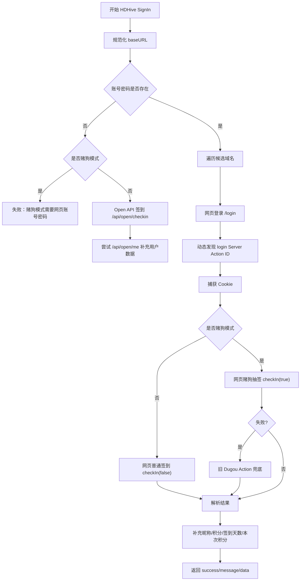
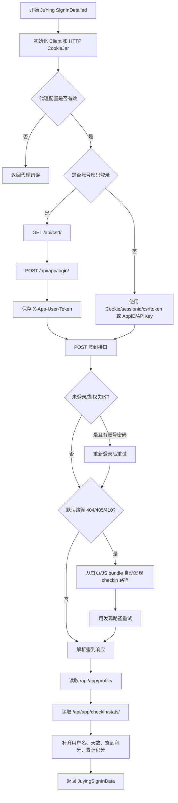
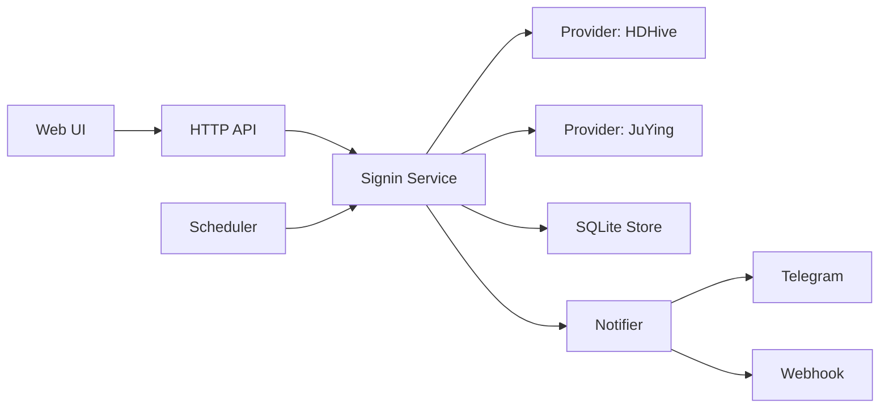

# 影巢与聚影签到独立应用设计文档

版本基准：AetherFlow v11.4.9  
整理日期：2026-05-16  
目标：把当前项目里的 HDHive（影巢）和 JuYing（聚影）签到能力抽离出来，设计成一个可独立部署、可多账号管理、可定时签到、可推送通知的轻量签到应用。

## 1. 背景与目标

当前 AetherFlow 已经实现了两类签到：

1. HDHive 影巢签到：
   - 支持 Open API 普通签到。
   - 支持网页账号密码登录后普通签到。
   - 支持网页账号密码登录后的“赌狗抽签”。
   - 支持自动发现 Next.js Server Action ID。
   - 支持多域名候选：`hdhive.com`、`hdhive.org`、`hdhive.online`。
   - 支持 TG 和 Webhook 通知。

2. JuYing 聚影签到：
   - 支持 AppID + API Key。
   - 支持账号密码登录。
   - 支持完整 Cookie。
   - 支持 `sessionid` + `csrftoken`。
   - 支持自动发现 checkin 接口路径。
   - 签到后补充读取 profile 和 checkin stats。
   - 推送内容包含用户名、签到状态、签到天数、签到积分和累计积分。

独立应用的目标是只保留“账号管理 + 手动签到 + 定时签到 + 通知 + 日志”这条链路，不再依赖 AetherFlow 的资源搜索、Emby、Media302、Telegram 抓取等大模块。

## 2. 当前代码位置

### 2.1 影巢相关代码

| 文件 | 当前职责 | 独立应用处理方式 |
| --- | --- | --- |
| `internal/hdhive/signin.go` | 影巢签到主流程、Open API 签到、网页签到、赌狗抽签入口、结果解析 | 核心保留 |
| `internal/hdhive/login.go` | 影巢网页登录、Cookie 捕获、登录 Server Action 调用 | 核心保留 |
| `internal/hdhive/actions.go` | 动态发现 Next.js Server Action ID、解析 chunk | 核心保留 |
| `internal/hdhive/dugou.go` | 赌狗抽签旧 Action 兜底逻辑 | 核心保留，作为可选模式 |
| `internal/hdhive/hosts.go` | 域名规范化和镜像域名候选 | 核心保留 |
| `internal/hdhive/client.go` | 代理 HTTP Client、`/api/open/me` 查询 | 核心保留，去掉对全局 config 的直接依赖 |
| `internal/worker/hdhive_scheduler.go` | 每分钟扫描 cron 并执行影巢签到 | 改造为通用 scheduler |
| `internal/web/aether_handlers.go` | `/api/hdhive/signin` 手动签到入口 | 改造成独立 Web API |
| `internal/notifier/webhook_notifier.go` | 影巢签到 Webhook 消息格式 | 提取到 notifier |

### 2.2 聚影相关代码

| 文件 | 当前职责 | 独立应用处理方式 |
| --- | --- | --- |
| `internal/juying/client.go` | 聚影客户端、登录、签到、路径发现、profile/stats 补充 | 核心保留 |
| `internal/worker/juying_scheduler.go` | 每分钟扫描 cron 并执行聚影签到 | 改造为通用 scheduler |
| `internal/web/aether_handlers.go` | `/api/juying/signin` 手动签到入口 | 改造成独立 Web API |
| `internal/notifier/webhook_notifier.go` | 聚影签到消息格式和 Webhook | 提取到 notifier |

### 2.3 共用代码

| 文件 | 当前职责 | 独立应用处理方式 |
| --- | --- | --- |
| `internal/models/models.go` | `HdhiveAccount`、`HdhiveMeData`、`JuyingAccount`、`JuyingSignInData` | 提取成独立 domain model |
| `internal/config/config.go` | 账号、站点、代理、通知配置 | 重做为签到应用配置 |
| `internal/utils/http_utils.go` | 动态代理 HTTP Client | 提取最小代理工具 |
| `internal/notifier/tg_notifier.go` | TG Bot 推送 | 提取为可选通知通道 |
| `internal/web/core_handlers.go` | 配置保存时敏感字段掩码处理 | 提取用于账号保存 |

## 3. 当前签到流程梳理

### 3.1 影巢签到流程

入口：`hdhive.SignIn(acc models.HdhiveAccount)`



关键点：

1. 没有账号密码时，只能走 Open API 普通签到。
2. 赌狗抽签必须有网页账号密码。
3. 网页签到依赖 Next.js Server Action：
   - 登录 action：`login`
   - 签到 action：`checkIn`
4. 代码会先从页面和 JS chunk 中动态发现 action id，失败时使用内置 fallback action id。
5. 网页登录会进行首页预热、`GET /login`、带浏览器 header 的 `POST /login`。
6. 登录后如果捕获 Cookie，会写回当前配置中的账号 Cookie。
7. 普通签到允许从用户资料页兜底提取积分变动；赌狗模式不使用普通积分记录兜底，避免误报。

### 3.2 聚影签到流程

入口：`juying.SignInDetailed(acc, baseURL, signInPath)`



关键点：

1. 默认签到路径是 `/api/app/checkin/do/`。
2. 账号密码模式会先请求 `/api/csrf/`，再登录 `/api/app/login/`。
3. 登录成功后使用 `X-App-User-Token`。
4. Cookie 模式会设置 `Cookie`，并从 Cookie 或字段中提取 `csrftoken` 放到 `X-CSRFToken`。
5. AppID/API Key 模式使用请求头：
   - `X-App-Id`
   - `X-App-Key`
6. 签到成功后继续读取：
   - `/api/app/profile/`
   - `/api/app/checkin/stats/`
7. 如果签到接口路径变了，会扫描首页和 JS bundle，尝试提取包含 `checkin` 的接口路径。

## 4. 独立应用的产品形态

建议做成一个小型 Web 应用，优先满足以下需求：

1. 多账号管理。
2. 影巢和聚影账号分开展示，也可以统一在“签到账号”列表中按平台过滤。
3. 支持手动签到单个账号。
4. 支持一键签到全部启用账号。
5. 支持每日定时签到。
6. 支持 TG 通知和 Webhook 通知。
7. 支持保存最近签到结果和历史日志。
8. 支持账号凭据加密或至少敏感字段掩码。
9. 支持 Docker 部署。

不建议在第一版加入资源搜索、转存、Emby、Media302 等能力，保持应用足够轻。

## 5. 推荐架构



### 5.1 后端模块建议

```text
cmd/signin-app/main.go
internal/domain/
  account.go
  result.go
internal/provider/
  provider.go
  hdhive/
    client.go
    login.go
    actions.go
    dugou.go
    hosts.go
  juying/
    client.go
internal/service/
  signin_service.go
  scheduler.go
internal/store/
  sqlite.go
  accounts.go
  settings.go
  records.go
internal/notifier/
  telegram.go
  webhook.go
  formatter.go
internal/web/
  server.go
  auth.go
  account_handlers.go
  signin_handlers.go
  config_handlers.go
internal/httpx/
  proxy.go
  client.go
web/
  index.html
  static/
```

### 5.2 核心接口

统一 provider 接口：

```go
type Provider interface {
    Platform() string
    SignIn(ctx context.Context, account Account, opts SignInOptions) (SignInResult, error)
}
```

统一签到服务：

```go
type SignInService struct {
    Store     Store
    Providers map[string]Provider
    Notifier  Notifier
}

func (s *SignInService) SignInAccount(ctx context.Context, accountID string, trigger string) (SignInResult, error)
func (s *SignInService) SignInAll(ctx context.Context, platform string, trigger string) ([]SignInResult, error)
```

统一通知接口：

```go
type Notifier interface {
    Send(ctx context.Context, result SignInResult) error
}
```

## 6. 数据模型设计

### 6.1 账号模型

建议独立应用不要沿用两个完全不同的账号结构，而是用统一账号表 + 平台专属字段 JSON。

```go
type Account struct {
    ID        string
    Platform  string // hdhive / juying
    Name      string
    Enabled   bool
    Cron      string // MM HH 或未来扩展为标准 cron
    NotifyTG  bool
    NotifyWebhook bool
    CreatedAt time.Time
    UpdatedAt time.Time

    Credential AccountCredential
    Options    AccountOptions
}
```

```go
type AccountCredential struct {
    Username  string
    Password  string
    APIKey    string
    AppID     string
    Cookie    string
    SessionID string
    CSRFToken string
}
```

```go
type AccountOptions struct {
    Dog bool // HDHive only
}
```

### 6.2 平台配置

```go
type PlatformConfig struct {
    HDHiveBaseURL     string
    HDHiveGlobalAPIKey string

    JuyingBaseURL     string
    JuyingSigninPath  string
    JuyingProxyMode   string // direct / tg_proxy / custom_proxy
    JuyingProxyURL    string
}
```

### 6.3 通知配置

```go
type NotifyConfig struct {
    TelegramBotToken string
    TelegramAdminID  string
    TelegramProxyURL string
    WebhookURL       string
}
```

### 6.4 签到结果模型

统一结果：

```go
type SignInResult struct {
    ID           string
    AccountID    string
    Platform     string
    AccountName  string
    Trigger      string // manual / schedule / batch
    Success      bool
    Message      string
    Mode         string

    Username     string
    Nickname     string
    Email        string
    SigninDays   int
    RewardPoints int
    TotalPoints  int

    Raw          string
    StartedAt    time.Time
    FinishedAt   time.Time
}
```

影巢字段映射：

| 统一字段 | 影巢来源 |
| --- | --- |
| `Mode` | `HdhiveMeData.SigninMode` 或账号 `Dog` |
| `Nickname` | `HdhiveMeData.Nickname` |
| `SigninDays` | `UserMeta.SigninDays`，兜底 `SigninDays` |
| `RewardPoints` | `GainedPoints` |
| `TotalPoints` | `UserMeta.Points` |
| `Message` | 签到响应解析后的 message |

聚影字段映射：

| 统一字段 | 聚影来源 |
| --- | --- |
| `Username` | `JuyingSignInData.Username` |
| `Email` | `JuyingSignInData.Email` |
| `SigninDays` | `SigninDays` |
| `RewardPoints` | `RewardPoints` |
| `TotalPoints` | `TotalPoints` |
| `Message` | `Message` |

## 7. 数据库设计

建议使用 SQLite，保留轻量部署优势。

```sql
CREATE TABLE IF NOT EXISTS settings (
  key TEXT PRIMARY KEY,
  value TEXT
);

CREATE TABLE IF NOT EXISTS accounts (
  id TEXT PRIMARY KEY,
  platform TEXT NOT NULL,
  name TEXT,
  enabled INTEGER NOT NULL DEFAULT 1,
  cron TEXT,
  notify_tg INTEGER NOT NULL DEFAULT 1,
  notify_webhook INTEGER NOT NULL DEFAULT 1,
  credential_json TEXT NOT NULL,
  options_json TEXT NOT NULL,
  created_at DATETIME NOT NULL,
  updated_at DATETIME NOT NULL
);

CREATE INDEX IF NOT EXISTS idx_accounts_platform ON accounts(platform);
CREATE INDEX IF NOT EXISTS idx_accounts_enabled ON accounts(enabled);

CREATE TABLE IF NOT EXISTS signin_records (
  id TEXT PRIMARY KEY,
  account_id TEXT NOT NULL,
  platform TEXT NOT NULL,
  account_name TEXT,
  trigger TEXT,
  success INTEGER NOT NULL,
  message TEXT,
  mode TEXT,
  username TEXT,
  nickname TEXT,
  email TEXT,
  signin_days INTEGER,
  reward_points INTEGER,
  total_points INTEGER,
  raw TEXT,
  started_at DATETIME NOT NULL,
  finished_at DATETIME NOT NULL
);

CREATE INDEX IF NOT EXISTS idx_signin_records_account ON signin_records(account_id, finished_at DESC);
CREATE INDEX IF NOT EXISTS idx_signin_records_platform ON signin_records(platform, finished_at DESC);
```

敏感字段建议至少做两层处理：

1. API 返回时掩码为 `********`。
2. 保存时若字段仍为 `********`，保留数据库旧值。

如果要进一步安全，可以给 `credential_json` 做应用级加密：

1. 启动时通过环境变量 `SIGNIN_SECRET_KEY` 注入密钥。
2. 使用 AES-GCM 加密 credential JSON。
3. 数据库存 ciphertext、nonce、version。

## 8. HTTP API 设计

### 8.1 登录与配置

| 方法 | 路径 | 说明 |
| --- | --- | --- |
| `POST` | `/api/login` | 登录 Web 控制台 |
| `GET` | `/api/config` | 读取全局配置 |
| `POST` | `/api/config` | 保存全局配置 |
| `POST` | `/api/config/test-telegram` | 测试 TG 通知 |
| `POST` | `/api/config/test-webhook` | 测试 Webhook |

### 8.2 账号管理

| 方法 | 路径 | 说明 |
| --- | --- | --- |
| `GET` | `/api/accounts` | 获取账号列表，可用 `?platform=hdhive` |
| `POST` | `/api/accounts` | 新增账号 |
| `PUT` | `/api/accounts/:id` | 更新账号 |
| `DELETE` | `/api/accounts/:id` | 删除账号 |
| `POST` | `/api/accounts/:id/toggle` | 启用/禁用账号 |

### 8.3 签到

| 方法 | 路径 | 说明 |
| --- | --- | --- |
| `POST` | `/api/signin/:id` | 手动签到单个账号 |
| `POST` | `/api/signin/batch` | 批量签到，支持平台过滤 |
| `GET` | `/api/signin/records` | 签到历史 |
| `GET` | `/api/signin/records/:id` | 某条签到详情 |

批量签到请求示例：

```json
{
  "platform": "juying",
  "only_enabled": true
}
```

签到结果示例：

```json
{
  "success": true,
  "data": {
    "platform": "juying",
    "account_name": "主号",
    "success": true,
    "message": "今日签到成功",
    "username": "user@example.com",
    "signin_days": 28,
    "reward_points": 5,
    "total_points": 365
  }
}
```

## 9. 调度器设计

当前 AetherFlow 的两个 scheduler 都是每分钟 tick，然后解析账号 `Cron` 字段的前两段 `MM HH`。

独立应用可以先沿用这个简单格式：

```text
40 8
```

表示每天 08:40 执行。

推荐增强：

1. 仍兼容 `MM HH`。
2. 增加随机延迟范围，避免多个账号同一秒发起请求。
3. 增加同账号同日防重复：
   - 如果当天已经有成功记录，默认跳过。
   - 手动签到可强制执行。
4. 增加执行锁：
   - 同一个账号同一时间只能有一个签到任务。
5. 增加任务结果记录：
   - 成功、失败、跳过、超时都落库。

调度器伪代码：

```go
func (s *Scheduler) tick(now time.Time) {
    accounts := store.ListEnabledAccounts()
    for _, acc := range accounts {
        if !cronMatches(acc.Cron, now) {
            continue
        }
        if store.HasSuccessToday(acc.ID) {
            continue
        }
        go s.signInWithLock(acc.ID, "schedule")
    }
}
```

## 10. 通知设计

### 10.1 统一通知内容

建议通知统一为下面格式，再由不同 provider 填充字段：

```text
⏰ {平台} 自动签到
👤 账号: {账号名}
✅ 状态: {成功/失败}
🎲 模式: {普通签到/赌狗抽签/接口签到}
📝 详情: {message}
📅 签到天数: {signin_days}
💰 本次积分: {reward_points}
💎 累计积分: {total_points}
```

影巢普通签到示例：

```text
⏰ 影巢自动签到
👤 账号: czerov
✅ 状态: 成功
🎲 模式: 普通签到
📝 详情: 今日已签到
📅 签到天数: 318
💰 本次积分: +5
💎 累计积分: 1953
```

影巢赌狗模式如果没有返回本次积分：

```text
💰 本次积分: 未知（赌狗接口未返回本次积分）
```

聚影示例：

```text
⏰ 聚影自动签到
👤 用户名: user@example.com
✅ 签到状态: 成功
📝 详情: 今日签到成功
📅 签到天数: 28
💰 签到积分: +5
💎 累计积分: 365
```

### 10.2 通知通道

| 通道 | 说明 |
| --- | --- |
| Telegram | Bot Token + Admin ID |
| Webhook | POST JSON 到自定义 URL |
| Web UI | 顶部 toast + 历史记录 |

Webhook Payload 建议：

```json
{
  "event": "signin_result",
  "platform": "juying",
  "account_name": "主号",
  "success": true,
  "message": "今日签到成功",
  "content": "完整可读文本",
  "signin_days": 28,
  "reward_points": 5,
  "total_points": 365,
  "timestamp": "2026-05-16T08:40:00+08:00"
}
```

## 11. 前端设计

建议做成 4 个主页面：

| 页面 | 内容 |
| --- | --- |
| 总览 | 今日签到成功/失败数量、下一次任务、最近结果 |
| 账号 | 影巢/聚影账号列表、启用状态、定时、手动签到按钮 |
| 配置 | 站点 URL、代理、TG、Webhook、Web 登录密码 |
| 历史 | 签到记录、筛选平台、查看错误详情 |

### 11.1 账号列表字段

| 字段 | 显示 |
| --- | --- |
| 平台 | 影巢 / 聚影 |
| 名称 | `name`、`user` 或 `username` |
| 状态 | 启用 / 禁用 |
| 定时 | `MM HH` |
| 上次签到 | 成功/失败 + 时间 |
| 积分 | 当前总分和本次积分 |
| 操作 | 签到、编辑、删除、启用/禁用 |

### 11.2 添加影巢账号

必填/可选建议：

| 字段 | 必填 | 说明 |
| --- | --- | --- |
| 名称 | 否 | 显示名称 |
| 账号 | 普通网页签到必填 | HDHive 登录用户名 |
| 密码 | 普通网页签到必填 | HDHive 登录密码 |
| API Key | Open API 签到必填 | 可放全局，也可账号级覆盖 |
| 赌狗抽签 | 否 | 启用后必须填写账号密码 |
| 定时 | 是 | 默认 `30 8` |
| TG 通知 | 否 | 默认启用 |
| Webhook | 否 | 默认启用 |

### 11.3 添加聚影账号

认证方式建议做成分段选择：

1. 账号密码登录。
2. Cookie 登录。
3. sessionid/csrftoken。
4. AppID/API Key。

字段显示随认证方式切换，避免页面臃肿。

## 12. 代码提取策略

### 12.1 需要先解除的全局依赖

当前签到代码直接依赖 `config.AppConfig`，独立应用要改成注入式配置。

| 当前依赖 | 问题 | 改造方式 |
| --- | --- | --- |
| `config.AppConfig.HdhiveBaseURL` | provider 内部读取全局配置 | 改为 `hdhive.Config` 注入 |
| `config.AppConfig.HdhiveApiKey` | Open API 和 GetMe 依赖全局 Key | 支持全局 Key + 账号级 Key |
| `config.AppConfig.JuyingProxyMode` | 聚影 HTTP Client 初始化依赖全局配置 | 改为 `juying.Config` 注入 |
| `config.AppConfig.TGProxy` | 代理工具依赖全局配置 | 改为 `httpx.ProxyConfig` |
| `config.SaveConfigToDB` | 影巢登录后写回 Cookie | 改为通过 Store 更新账号 Cookie |
| `notifier` 依赖 config | 通知读取全局配置 | 改为 notifier 初始化时注入配置 |

### 12.2 建议的 provider 配置

影巢：

```go
type HDHiveConfig struct {
    BaseURL      string
    GlobalAPIKey string
    ProxyURL     string
    Timeout      time.Duration
}
```

聚影：

```go
type JuYingConfig struct {
    BaseURL     string
    SigninPath  string
    ProxyMode   string
    ProxyURL    string
    TGProxyURL  string
    Timeout     time.Duration
}
```

### 12.3 提取顺序

推荐按下面顺序拆，风险最低：

1. 复制 `HdhiveAccount`、`HdhiveMeData`、`JuyingAccount`、`JuyingSignInData` 到新应用的 `domain`。
2. 复制 `internal/hdhive` 到新应用 provider，并让它先能编译。
3. 把 `config.AppConfig` 读取改成 `HDHiveConfig` 注入。
4. 把 `updateAccountCookie` 改成 callback：

```go
type CookieUpdater func(accountID string, cookie string) error
```

5. 复制 `internal/juying`，把 `configuredProxyURL` 改成读取 `JuYingConfig`。
6. 复制 notifier 格式化函数，改成吃 `SignInResult`。
7. 实现 SQLite store。
8. 实现手动签到 API。
9. 实现 scheduler。
10. 最后做 Web UI。

## 13. 最小可用版本 MVP

MVP 只需要：

1. SQLite 存账号和配置。
2. Web 登录。
3. 添加/编辑/删除账号。
4. 手动签到单个账号。
5. 一键签到所有启用账号。
6. 每分钟调度 `MM HH`。
7. 保存签到记录。
8. TG/Webhook 通知。
9. Docker 部署。

MVP 可以暂时不做：

1. 复杂权限系统。
2. 多用户。
3. 多工作空间。
4. 标准 cron 表达式。
5. WebSocket 实时日志。
6. 资源搜索相关功能。

## 14. 风险点与处理建议

| 风险 | 影响 | 建议 |
| --- | --- | --- |
| HDHive Next.js Action ID 变化 | 登录或签到失败 | 保留动态发现逻辑，并允许手动覆盖 fallback action id |
| HDHive Cloudflare/风控 | 网页登录失败 | 保留浏览器 header、TLS 配置和代理配置；失败时提示重新输入账号密码 |
| 赌狗模式未返回积分 | 通知积分不准 | 明确显示“未知”，不要用普通积分记录兜底 |
| 聚影接口路径变化 | 签到 404/405/410 | 保留自动发现 checkin 路径逻辑 |
| 聚影账号密码登录 token 格式变化 | 登录失败 | 提取 token 时保留多字段候选，并把原始响应摘要写入日志 |
| Cookie 过期 | 签到失败 | 提供失败提示，并支持账号密码自动刷新 |
| 多账号同一时间触发 | 风控风险 | 增加随机延迟和并发限制 |
| 敏感信息泄露 | 安全风险 | API 掩码、日志脱敏、可选数据库加密 |

## 15. 测试计划

### 15.1 单元测试

从当前项目可迁移的测试重点：

| 测试 | 来源 |
| --- | --- |
| 影巢域名候选和 baseURL 规范化 | `internal/hdhive/client_test.go` |
| 影巢签到消息解析 | `parseHdhiveWebCheckinMessage` |
| 影巢积分/天数提取 | `populateSigninResultData` |
| 影巢 Server Action ID 动态发现 | `discoverHdhiveServerActionID` |
| 赌狗抽签兜底逻辑 | `DugouSignIn` / `executeHdhivePostLoginCheckin` |
| 聚影签到默认路径 | `TestSignInUsesDefaultCheckinPath` |
| 聚影账号密码登录 | `TestSignInLogsInWithUsernamePassword` |
| 聚影路径自动发现 | `TestSignInDiscoversCheckinPathFromBundle` |
| 聚影 Cookie 优先 | `TestSignInPrefersWebCookieAuth` |
| 通知内容包含统计字段 | `TestFormatJuyingSigninMessageIncludesStats` |

### 15.2 集成测试

1. 使用 `httptest.Server` 模拟 HDHive 登录页、Next.js chunk、签到响应。
2. 使用 `httptest.Server` 模拟聚影 CSRF、登录、签到、profile、stats。
3. 使用 SQLite 临时数据库测试账号保存、掩码保存、签到记录落库。
4. 使用测试 Webhook Server 验证 payload 字段完整。
5. 使用虚拟时钟测试 scheduler 在指定分钟只触发一次。

## 16. Docker 部署设计

建议端口使用 `7899`，避免和 AetherFlow 的 `7888` 冲突。

```yaml
services:
  signin-app:
    image: czerov/signin-app:latest
    build: .
    container_name: signin-app
    restart: unless-stopped
    ports:
      - "7899:7899"
    volumes:
      - ./data:/app/data
    environment:
      - TZ=Asia/Shanghai
      - SIGNIN_DB=/app/data/signin.db
      - SIGNIN_WEB_USERNAME=admin
      - SIGNIN_WEB_PASSWORD=admin
      # 可选：启用凭据加密
      # - SIGNIN_SECRET_KEY=change-me-32-bytes
```

健康检查：

```text
GET /ping -> pong signin-app v0.1.0
```

## 17. 独立应用配置示例

```json
{
  "timezone": "Asia/Shanghai",
  "web": {
    "username": "admin",
    "password": "admin"
  },
  "notify": {
    "telegram_bot_token": "",
    "telegram_admin_id": "",
    "telegram_proxy_url": "",
    "webhook_url": ""
  },
  "providers": {
    "hdhive": {
      "base_url": "https://hdhive.com",
      "global_api_key": "",
      "proxy_url": ""
    },
    "juying": {
      "base_url": "https://share.huamucang.top",
      "signin_path": "/api/app/checkin/do/",
      "proxy_mode": "direct",
      "proxy_url": ""
    }
  }
}
```

账号示例：

```json
{
  "platform": "juying",
  "name": "主号",
  "enabled": true,
  "cron": "40 8",
  "notify_tg": true,
  "notify_webhook": true,
  "credential": {
    "username": "user@example.com",
    "password": "********",
    "app_id": "",
    "api_key": "",
    "cookie": "",
    "sessionid": "",
    "csrftoken": ""
  },
  "options": {}
}
```

## 18. 与当前 AetherFlow 的差异

| 当前 AetherFlow | 独立签到应用 |
| --- | --- |
| 配置在一个大 `Config` 结构里 | 只保留签到相关配置 |
| provider 读取全局 `config.AppConfig` | provider 通过构造参数注入配置 |
| HDHive 登录后直接 `SaveConfigToDB` | 通过账号仓库更新该账号 Cookie |
| Web UI 和资源搜索混在系统配置页 | 单独账号页和签到历史页 |
| 通知格式散在现有 notifier | 统一 `SignInResult` 格式化 |
| 无持久签到记录表 | 每次签到结果落库，便于查询 |
| 每分钟简单 tick | 增加同日防重复、账号执行锁、随机延迟 |

## 19. 推荐落地步骤

1. 新建仓库或新建子目录 `signin-app`。
2. 搭建 Go + Gin + SQLite + 简单 Vue/原生 JS 前端。
3. 先实现 Store、Config、Account CRUD。
4. 提取聚影 provider，因为它对 AetherFlow 依赖更少，先完成账号密码和 Cookie 签到。
5. 提取影巢 provider，重点处理 `config.AppConfig`、代理和 Cookie 回写。
6. 实现统一 `SignInResult` 和通知格式。
7. 实现手动签到 API 和 Web UI。
8. 实现 scheduler。
9. 添加 Dockerfile 和 compose。
10. 迁移现有单元测试，补齐集成测试。

## 20. 结论

影巢和聚影的签到能力可以比较干净地抽成独立应用。真正需要处理的不是签到逻辑本身，而是把当前的全局配置、通知、存储和 Web handler 从 AetherFlow 大系统里拆开。

优先建议做一个小而稳的 MVP：多账号、手动签到、定时签到、TG/Webhook、历史记录。等它稳定后，再考虑更复杂的功能，比如失败重试策略、凭据加密、多用户权限、移动端适配和统一导入导出。

